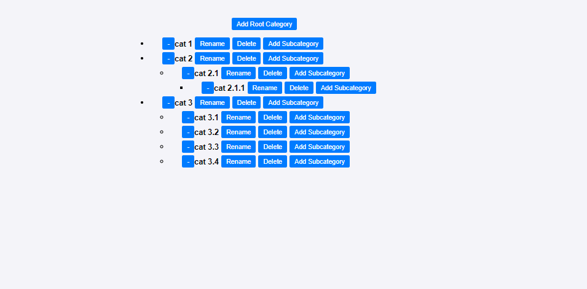

# Category Tree

This project is a React application that implements a dynamic category tree. The tree allows users to add, rename, delete, and expand/collapse categories. The project is built with TypeScript for type safety and CSS for styling.

## Features

- **Add New Subcategories**: Create new subcategories under any existing category.
- **Rename Category**: Rename any category in the tree.
- **Delete Category**: Delete any category and its subcategories.
- **Expand/Collapse Categories**: Expand or collapse categories to show or hide their subcategories.
